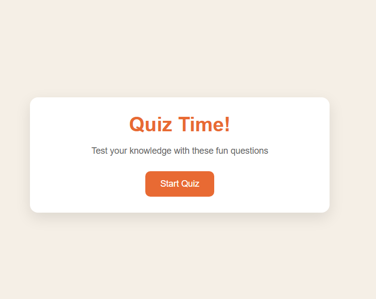
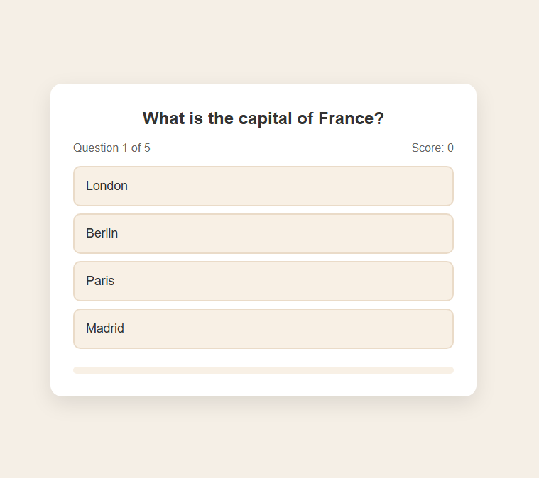
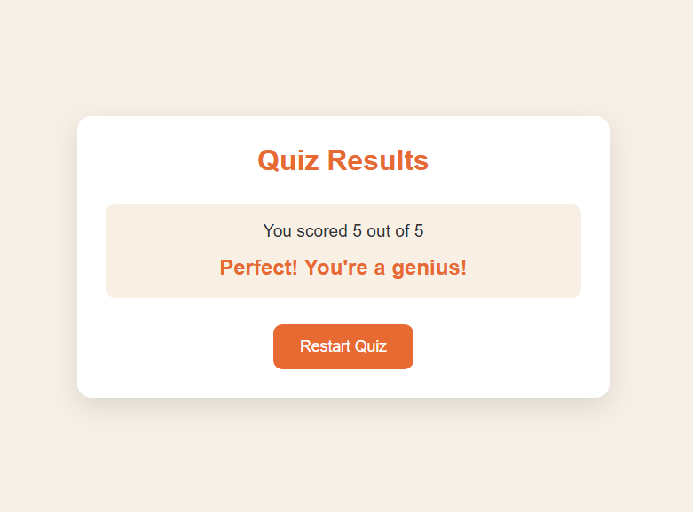

# Quiz Game

This is a simple, interactive quiz game built with HTML, CSS, and JavaScript. Test your knowledge with a series of multiple-choice questions\!

## Features

  * **Engaging User Interface:** Clean and responsive design using CSS.
  * **Interactive Gameplay:** Users can select answers and receive immediate feedback.
  * **Score Tracking:** Keeps track of the user's score throughout the quiz.
  * **Progress Bar:** Visual indicator of quiz progress.
  * **Result Screen:** Displays the final score and a personalized message based on performance.
  * **Restart Option:** Allows users to play the quiz again.
...

## Screenshot Previews

Here are some glimpses of the Quiz Game in action:

### Start Screen

_The initial screen where users can begin the quiz._

### Quiz in Progress

_Answering a question, with the progress bar and score visible._

### Results Screen

_Displaying the final score and a performance message._

...

## How to Play

1.  **Start the Quiz:** Click the "Start Quiz" button on the welcome screen.
2.  **Answer Questions:** Select one of the provided answer choices for each question.
3.  **View Results:** After answering all questions, your final score and a performance message will be displayed.
4.  **Restart:** Click the "Restart Quiz" button to play again.

## Project Structure

  * `index.html`: The main HTML file that structures the quiz game, including the start screen, quiz screen, and result screen.
  * `style.css`: Contains the CSS rules for styling the quiz game, ensuring a visually appealing and responsive layout.
  * `script.js`: Implements the core logic of the quiz game, handling question display, answer checking, score calculation, and screen transitions.

## Customization

### Adding/Modifying Questions

You can easily add, remove, or modify the quiz questions in the `script.js` file. Locate the `quizQuestions` array and modify its contents. Each question object should have:

  * `question`: A string containing the question text.
  * `answers`: An array of answer objects, each with:
      * `text`: The answer choice text.
      * `correct`: A boolean indicating whether the answer is correct (`true`) or incorrect (`false`).

**Example:**

````javascript
const quizQuestions = [
  {
    question: "What is the capital of France?",
    answers: [
      { text: "London", correct: false },
      { text: "Berlin", correct: false },
      { text: "Paris", correct: true },
      { text: "Madrid", correct: false },
    ],
  },
  // Add more questions here
];
````
